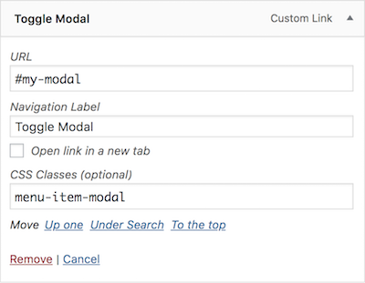
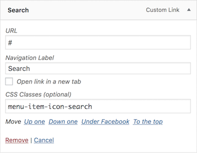
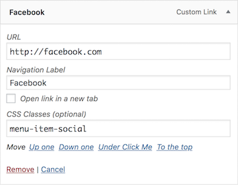
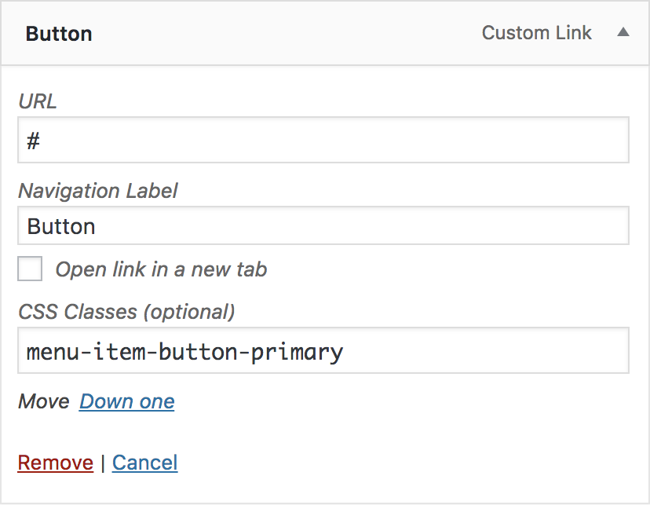
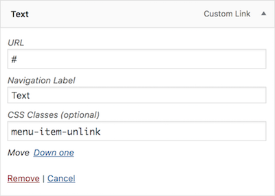
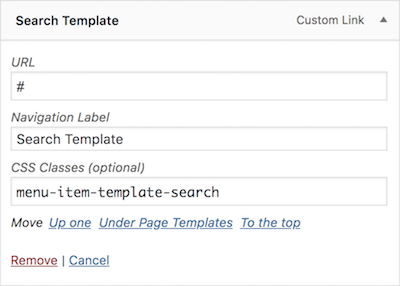

# Wordpress Theme
Bootstrap driven WordPress theme.

## Installation

1. [Download](https://github.com/mmaarten/theme/archive/master.zip) and extract zip into `wp-content/themes/` folder.
1. Run `npm install` to install Node modules.
1. Run `bower install` to install vendors.
1. Run `grunt dist` to create assets folder.
1. Activate theme via WordPress admin menu: Appearance/Themes.

## Features
- svg icons.
- Bootstrap styled [Gravity Forms](https://www.gravityforms.com/).
- Bootstrap [navbar](http://getbootstrap.com/docs/4.1/components/navbar/).
- [Advanced Custom Fields](https://www.advancedcustomfields.com/) option page.
- Menu item utilities.

### Menu Items
This theme provides some usefull features for menu items:

#### Modal
Menu item with CSS class `menu-item-modal` sets link attribute `data-toggle="modal"`.
Set item 'URL' setting to refer to the modal.
*Note: Only works with 'Custom Links'.*

#### Icon
Adds an icon inside a menu item.
Define the icon by following CSS class format: `menu-item-icon-{icon_name}`
Example: `menu-item-icon-search` displays a search icon.

#### Social Icon
Item with CSS class `menu-item-social` adds social icon based on the item URL.

#### Button
Converts a menu item to a button.
Example: Menu item with CSS class `menu-item-button-primary menu-item-button-sm` sets link class `btn btn-primary btn-sm`.

#### Unlink
Remove link from menu item with CSS class `menu-item-unlink`.

#### Template
Replace all item content with template content.

Template can be set by using CSS class format: `menu-item-template-{template_name}`.
The loaded template will be: `template-parts/menu-item-{template_name}.php`

